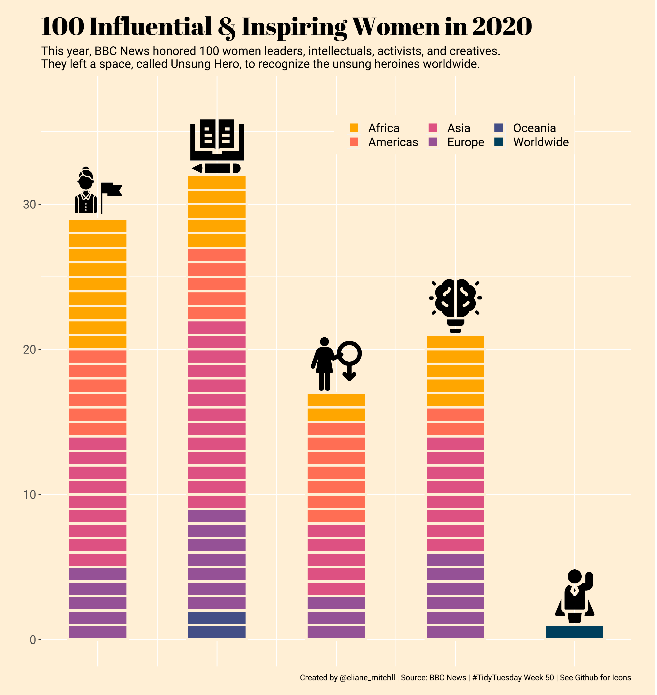

 Libraries:
```{r eval=FALSE}
library(tidyverse)
library(countrycode)
library(png)
library(showtext)
library(ggimage)
```

Fonts:
```{r eval=FALSE}
font_add_google("Abril Fatface", "abril")
font_add_google("Roboto", "roboto slab")
showtext_auto()
```

Load data:
```{r eval=FALSE}
tt <- tidytuesdayR::tt_load('2020-12-08')
women <- tt$women
```

## Preparing the data:
Add index number to the data.frame
```{r eval=FALSE}
data <- women %>% 
  mutate(index = row_number())
```

Add continent to dataset
```{r eval=FALSE}
continents <- data %>% 
  mutate(continent = countrycode(country, "country.name", "continent")) %>% 
  # adding missing continents
  mutate(continent = case_when(
    country == "Worldwide" ~ "Worldwide",
    country == "Exiled Uighur from Ghulja (in Chinese, Yining)" ~ "Asia",
    country == "Northern Ireland" ~ "Europe",
    country == "Wales, UK" ~ "Europe",
    TRUE ~ continent
  ))
```

Adding category numbers:
```{r eval=FALSE}
cat_num <- continents %>% 
  mutate(cnum = case_when(
    category == "Leadership" ~ 1,
    category == "Knowledge" ~ 2,
    category == "Identity" ~ 3,
    category == "Creativity" ~ 4,
    TRUE ~ 5
  )) 
```

```{r eval=FALSE}
imgs <- c(
  here::here("img", 4, "1.png"),
  here::here("img", 4, "2.png"),
  here::here("img", 4, "3.png"),
  here::here("img", 4, "4.png"),
  here::here("img", 4, "5.png")
)

with_imgs <- cat_num %>% 
  mutate(imgs = case_when(
    category == "Leadership" ~ imgs[cnum],
    category == "Knowledge" ~ imgs[cnum],
    category == "Identity" ~ imgs[cnum],
    category == "Creativity" ~ imgs[cnum],
    TRUE ~ imgs[cnum]
  )) %>% 
  add_count(category)
```


## Visualization:

```{r eval=FALSE}
colors <- c("#ffa600", "#ff6e54", "#dd5182", "#955196", "#444e86", "#003f5c")

p1 <- with_imgs %>% 
  ggplot(aes(x = cnum, y = 1, fill = continent, width = .5)) +
  geom_bar(stat = "identity", color = "papayawhip", size = 1.1) + 
  geom_image(aes(
    image = imgs,
    y = n + 2
  ),
  size = .09) +
  scale_fill_manual(values = colors) +
  xlim(0.75, 5.25) +
  ylim(0, 37) +
  theme(
    aspect.ratio = 1,
    panel.background = element_rect(fill = "papayawhip"),
    plot.background = element_rect("papayawhip")
  )
```

```{r plot, fig.width=10,fig.height=10, fig.path="output", dev='png', fig.showtext=TRUE, eval=FALSE}

p1 + 
  labs(title = "100 Influential & Inspiring Women in 2020",
       subtitle = "This year, BBC News honored 100 women leaders, intellectuals, activists, and creatives.\nThey left a space, called Unsung Hero, to recognize the unsung heroines worldwide.",
       caption = "Created by @eliane_mitchll | Source: BBC News | #TidyTuesday Week 50 | See Github for Icons") +
  theme(
    axis.title = element_blank(),
    axis.text.x = element_blank(),
    axis.ticks.x = element_blank(),
    text = element_text(family = "roboto slab", size = 15),
    plot.title = element_text(family = "abril", size = 25, hjust = 0),
    plot.subtitle = element_text(size = 12, hjust = 0),
    plot.caption = element_text(size = 8, hjust = 1),
    plot.margin = margin(25,25,25,25),
    legend.direction = "horizontal",
    legend.background = element_rect(fill = "papayawhip"),
    legend.title = element_blank(),
    legend.key.size = unit(0.5, "cm"),
    legend.position = c(0.70, 0.90)
  )

```



```{r eval=FALSE}
ggsave(plot = last_plot(),
       filename = here::here("output", "4.pdf"),
       dpi = 300,
       height = 10, width = 10)
```


Original: [Eliane Mitchell](https://github.com/elianemitchell/mytidytuesdaycode/blob/main/bbcwomen2020_week50_2020.R)