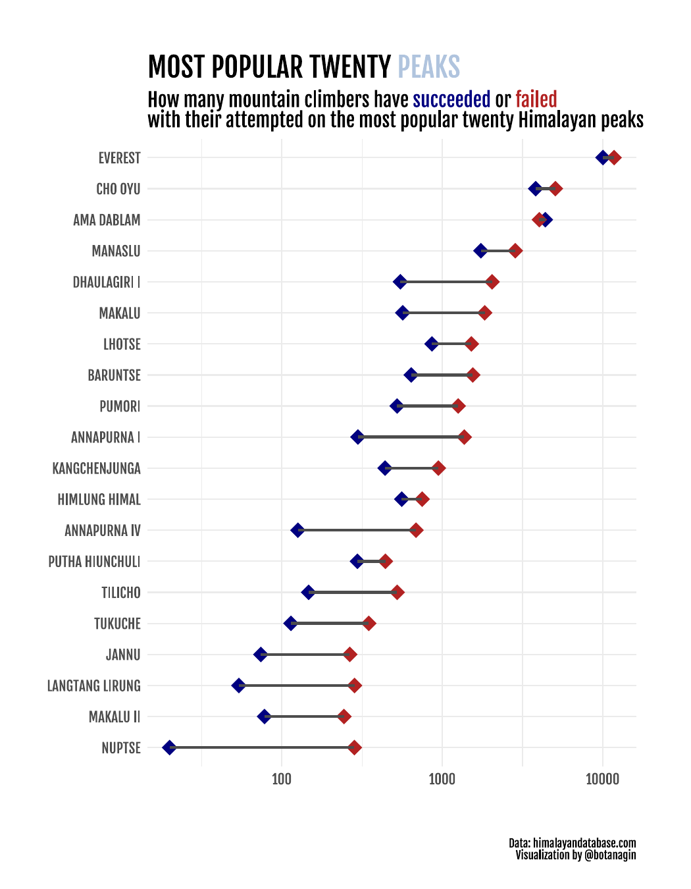

```{r setup, include=FALSE}
knitr::opts_chunk$set(echo = TRUE)
```

Packages:
```{r eval=FALSE}
library(tidyverse)
library(showtext)
library(ggtext)
```

Adding font:
```{r eval=FALSE}
font_add_google("Fjalla One", family = "fone")
showtext_auto()
```

Data:
```{r eval=FALSE}
tt <- tidytuesdayR::tt_load(2020, week = 39)
peaks <- tt$peaks
members <- tt$members
```

Wrangle the data:
```{r eval=FALSE}
peaks_tidy <- members %>% 
  group_by(peak_name) %>% 
  summarise(n = n(),
            success = sum(success),
            fail = n - success) %>% 
  ungroup() %>% 
  pivot_longer(success:fail, "success") %>% 
  mutate(peak_name = str_to_upper(peak_name) %>% fct_reorder(n)) %>% 
  arrange(desc(n)) %>% 
  slice_head(n = 40)
```


Visualizing: 
```{r eval=FALSE}

peaks_tidy %>% 
  ggplot(aes(value, y = peak_name, color = success, group = peak_name)) +
  geom_point(size = 4, stroke = 2, shape = 18) + 
  geom_line(size = 1, color = "grey30") + 
  scale_x_log10() + 
  scale_color_manual(values = c("firebrick", "navy")) +
  labs(
    x = "",
    y = "",
    title = "MOST POPULAR TWENTY <span style='color:lightsteelblue'>PEAKS</span>",
    subtitle = "How many mountain climbers have <span style='color:navy'>succeeded</span> or <span style='color:firebrick'>failed</span> <br> with their attempted on the most popular twenty <span style='color:black'>Himalayan</span> peaks",
    caption = "\n \n Data: himalayandatabase.com
    Visualization by @botanagin"
  ) +
  theme_minimal() + 
  theme(
    text = element_text(family = "fone"),
    legend.position = "none",
    plot.subtitle = element_markdown(size = 14),
    plot.title = element_markdown(size = 20),
    plot.caption = element_text(size = 8),
    axis.text = element_text(size = 10),
    plot.margin = margin(40, 40, 20, 20)
  )


```

Saving the plot:
```{r eval=FALSE}
ggsave(here::here("output", "2020-w39-himalayanclimbing.pdf"), 
       plot = last_plot(),
    height = 9, width = 7, units = "in", dpi = 300)
```


Original: [Botan Ağın](https://github.com/botan/tidytuesday/blob/main/R/2020-w39-himalayanclimbing.Rmd)